# Web Cache Proxy Support GET/POST/CONNECT（C++)


**Author:**

* jl1000

* wg83
        

**This is the HM2 ECE568 For Duke University.** 


## 0 **Usage**

### 0.1 Boot

There are two ways you can boot up our proxy

* **method1: using docker compose**

```shell
sudo docker-compose up
```

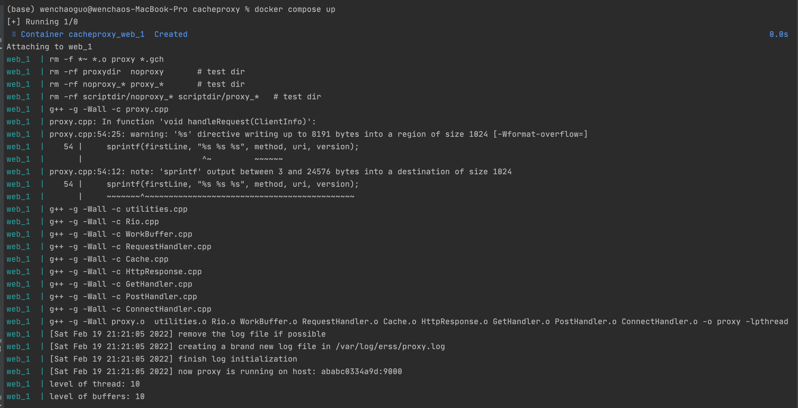

* **method2: using run.sh**
    * note this method will boot proxy in ==9000==
    * also we usually use this mode to develop and debug

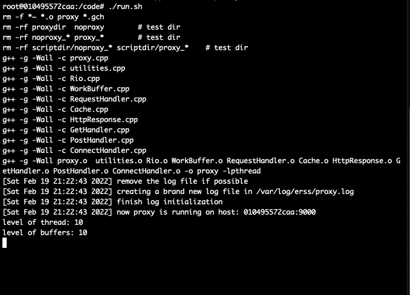


Everytime, you can see from our log that it will be running on \<hostname: portnumber \> 

* this can be an indicator of where it is running on


### 0.2 Test Method

### 0.2.1 Testing Get Method

> **Test Multi-thread**

using scipt ==pressure.sh==

```shell
./pressuretest.sh arg1 arg2
where arg1 < arg2 and they are numbers
```

* like `./pressuretest.sh 0 10`
* it will spawn 9 threads and fetch resources currently using proxy and not
* then it will compare what they get, if file is different, it will report an error
* final we can get result like this

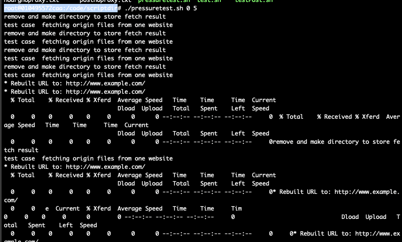

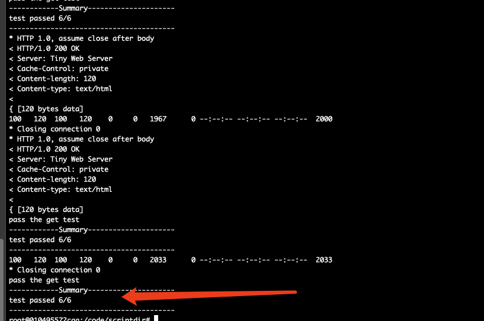


note this script works in port 9000. You can change it to any port you want to test


**using nopserver.py test**

```python
#!/usr/bin/python

# this is only used for testing
# once the server is booted, it will spin forever

import socket
import sys

serverSocket = socket.socket(socket.AF_INET, socket.SOCK_STREAM)
serverSocket.bind(('', int(sys.argv[1])))
serverSocket.listen(5)

while 1:
    channel, details = serverSocket.accept()
    print ('Connection Establish with Nop Server' +  str(details))

    while 1: # spin forever
        continue
```

This server will spin forever. It can also be a way to test multi-thread


> **Test Get Cache**

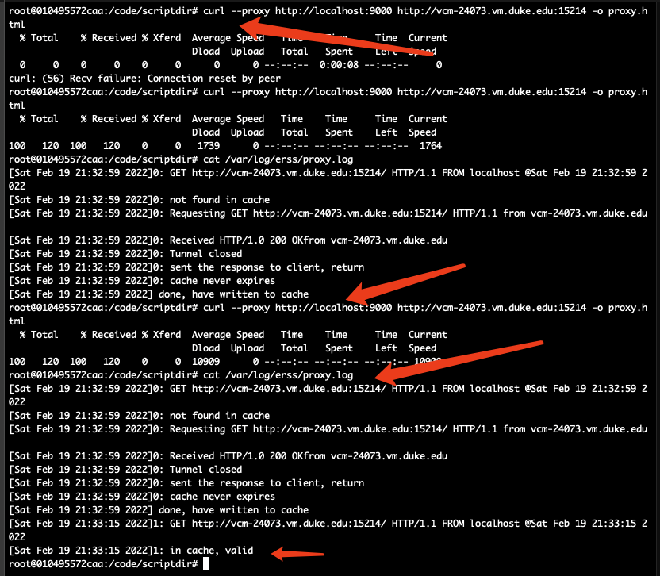


by using curl and log, we can see cache is being used to fetch resource

```shell
curl --proxy http://localhost:9000 http://vcm-24073.vm.duke.edu:15214 -o proxy.html
cat /var/log/erss/proxy.log
curl --proxy http://localhost:9000 http://vcm-24073.vm.duke.edu:15214 -o proxy.html
```


### 0.2.2 Test Post

we use shell script `testPost.sh`

* the remote server will return the identical response to client 
* and we use that to test


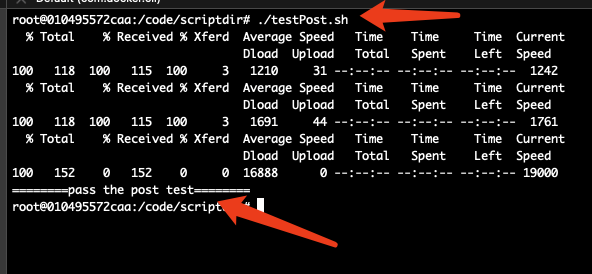


## 1 What we implement


## 1.0 Socket & Rio

* Using getaddrinfo to write portable code. We do not need to worry the type of the socket and whether it is IPv4 or IPv6
* Since UNIX read / write may occur some unexpection things. We use Rio from CMU as the wrapper to do the dirty work


Also based on the feature of connect, we use IO Multiplexing to handle different file descriptors when events come


## 1.1 GET Request

Using Firefox since it is easy to configure the proxy

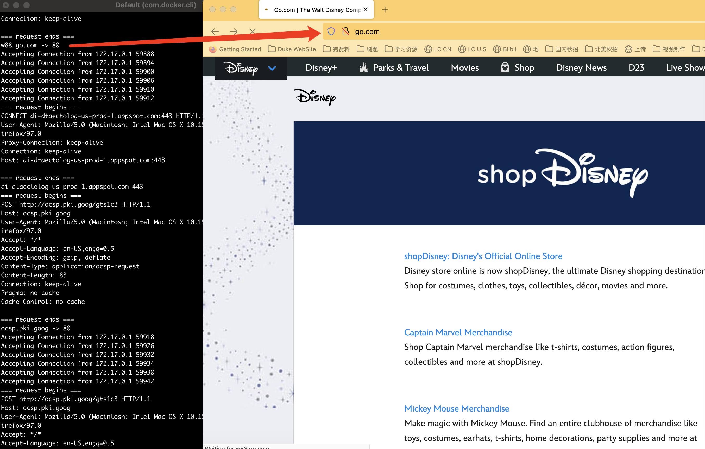


Notice that many requests have been sent during one get request. Some of them are CONNECT and POST issued by the browser


**Also we have created a pressure test, running 3 or more processes to access 5 different files using proxy and not using it. Then we compare the result.**

* This can be used to test concurrency and cache control


## 1.2 POST Request

using postman to send the request, configuring our program to be the proxy

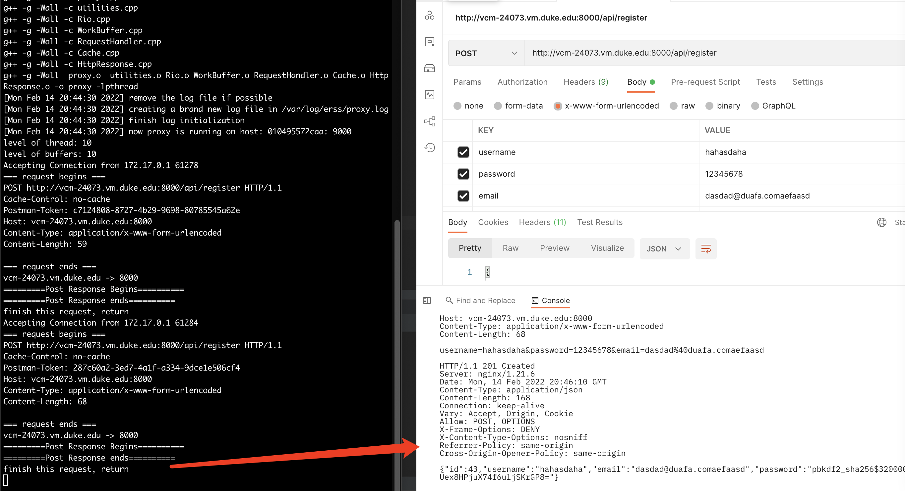

The service it is looking for is the ride service we write for hm1


## 1.3 CONNECT Request

Test connect using https://www.google.com

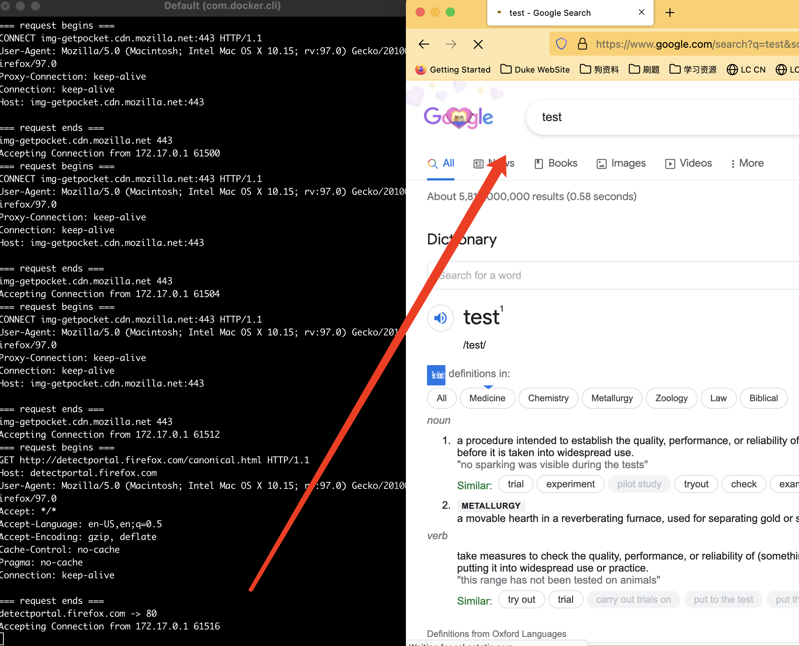


## 1.4 Cache

## 1.4.1 Cache Policy

The real cache policy is complex. We have recognized several key words

* Cache-control: immutable
* Cache-control: max-age=XXX
* Cache-control: no-store
* Cache-control: no-cache
* Cache-control: need-revalidate
* Cache-control: private
* Cache-control: public
* cache-control: must-revalidate
    * this will be seen as max-age=0

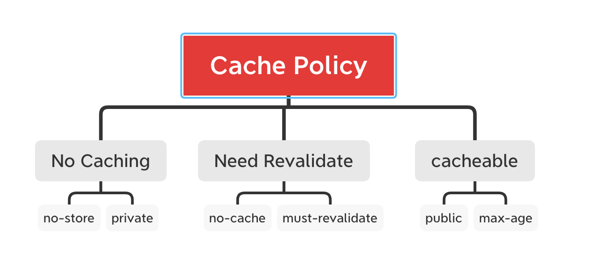

## 1.4.2 Cache Design

We use **LRU-like Data Structure** and limit the size for each response and the total cache size.

the data structure is 

```c++
class Node{
public:

    /* host name */
    string host;

    /* unique identifier */
    string uri;

    /* Response for this request */
    GetResponse gr;
    Node* next;
    Node* prev;
}
```

**cache and evict policy**

* consider that if we want to do the actual LRU, we will modify the cache when we read data.

* Thus we implement a LRU-Like policy where all fresh data is at the head of the linked list
* if we find that one cache is out-of-data or is way more big, we avoid to add it into the cache

**two macro have been defined**

* MAX_OBJECT_SIZE is the max size for one response. If it is larger, we discard it
* MAX_CACHE_SIZE is the max size of in memory cache.


## 1.5 Concurrency Control

* Using Read/Write Lock to help control the entry of cache.
* Using pre-created threads to de-couple the incoming client and working threads
    * avoid the busy spin for CPU

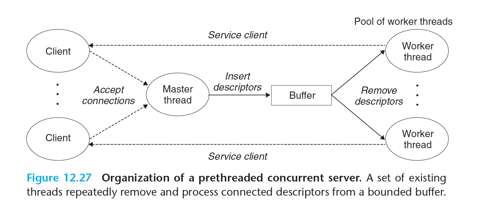

source: CSAPP Cpt12 CMU


## 2 Acknowledgment / Reference


**1 Linux Man Page** 

* getaddrinfo https://man7.org/linux/man-pages/man3/getaddrinfo.3.html
* getnameinfo https://man7.org/linux/man-pages/man3/getnameinfo.3.html
* recv https://man7.org/linux/man-pages/man2/recv.2.html
* send https://man7.org/linux/man-pages/man2/send.2.html
* select https://man7.org/linux/man-pages/man2/select.2.html


**2 Http Request Sample (mozilla)**

* Get https://developer.mozilla.org/en-US/docs/Web/HTTP/Methods/GET
* Post https://developer.mozilla.org/en-US/docs/Web/HTTP/Methods/post
* Connect https://developer.mozilla.org/en-US/docs/Web/HTTP/Methods/connect
* Cache control https://developer.mozilla.org/en-US/docs/Web/HTTP/Headers/Cache-Control


**3 Computer Systems: A Programmer's Perspective, 3/E (CS:APP3e)** by [Randal E. Bryant](http://www.cs.cmu.edu/~bryant) and [David R. O'Hallaron](http://www.cs.cmu.edu/~droh), Carnegie Mellon University

* **Chapter 8 Exception Control Flow**. Signal Handler

* **Chapter 10 System-Level IO**. Robust IO Package
* **Chapter 11 Network Programming**. function  open_clientfd and open_listenfd
* **Chapter 12 Concurrent Programming**. Read and Write Lock Design & WorkBuffer Design


**4 MapReduce: Simplified Data Processing on Large Clusters From Google**

