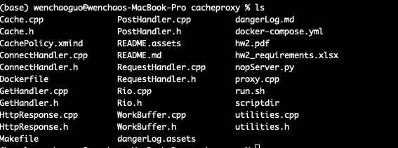

# 1 Dead Lock if one thread is down


> **Cache.cpp:writeToCache**

```c++
int Cache::writeToCache(string host, string uri, GetResponse gr){
    Log myLog;
    P(&this->W);

    /*********** critical section begins **************************************/
    int cacheSize = gr.response.size();
    if(cacheSize > MAX_OBJECT_SIZE || cacheSize + totalSize > MAX_CACHE_SIZE){
        myLog.write("too large, cannot write to cache " + host + "/" + uri);
    }else{
        Node* newNode = new Node(host, uri, gr);
        this->addNode(newNode);
        myLog.write(" done, have written to cache");
    }
    /*********** critical section ends ***************************************/

    V(&this->W);
    return 0;
}
```

In this function, there might be a chance when a thread is holding the lock while writing to cache, suddenly it is down. Any other threads who want to access to the cache may need to wait outside.


# 2 privilege check and leak of privacy



Currently our code files do not have rights to prevent user from browsering.

* let's say they send a curl like this

```shell
curl --proxy http://localhost:9000 http://localhost:9000/Cache.cpp -o Cache.cpp
```

There is a chance that we will have no check and send it anyway.

**In the future, we can do some right check so that none can get our files**


# 3 Cannot prevent DDOS

Right now every connection will be established once it wants. But if there are many requests who take long time, we will have no way to terminate it.

```c++
    while(1){
        socklen_t addrLen = sizeof(struct sockaddr_storage);
        int clientfd = Accept(listenfd, (SA*)&clientAddr, &addrLen);
        if(clientfd < 0){
            myLog.write("bad request from client, we discard");
            continue;
        }

        Getnameinfo((SA*)&clientAddr, addrLen, hostName, MAXLINE, port, MAXLINE, 0);
        cout << "Accepting Connection from " +  string(hostName) + " "+ string(port) + "\n";

        ClientInfo clientInfo(to_string(requestUUID), hostName, clientfd, tt.currentTimeNoBracket());
        requestUUID++;
        sm.insertFd(clientInfo);
    }
```

in the future, we can add some timer to check, as well as firewall to filter the bad request from specific IP address


